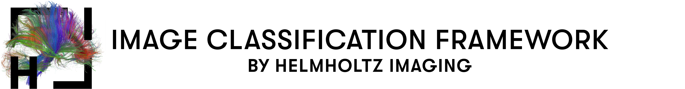

<div align="center">
<p align="left">
  
</p>

<a href="https://www.python.org/"></a>
<a href="https://pytorch.org/get-started/locally/"></a>
<a href="https://pytorchlightning.ai/"></a>
</div>

# Help a Hematologist Out Challenge

This repository is based on the Image Classification and Regression Framework by Helmholtz Imaging! You can check it out here: https://github.com/MIC-DKFZ/image_classification

Similar frameworks are available for [semantic segmentation](https://github.com/MIC-DKFZ/semantic_segmentation) and [object detection](https://github.com/MIC-DKFZ/generalized_yolov5)!

For reproducing our model training you need to place the ```splits.json``` in the data directory and then run all 5 folds:
```
python main.py ResNet34 --data AcevedoMatek --num_classes 11 --augmentation bg --scheduler CosineAnneal --metrics f1 f1_per_class --batch_size 128 --num_workers 32 --epochs 500 --lr 0.1 --sampler weighted_and_random --balanced --random_prob 0.66 --fold 0 --save_model --chpt_name RN34_fold0

...

python main.py ResNet34 --data AcevedoMatek --num_classes 11 --augmentation bg --scheduler CosineAnneal --metrics f1 f1_per_class --batch_size 128 --num_workers 32 --epochs 500 --lr 0.1 --sampler weighted_and_random --balanced --random_prob 0.66 --fold 4 --save_model --chpt_name RN34_fold4
```

For inference run:
```
python predict.py --cp_dir path/to/checkpoint_dir --data_dir path/to/hematology_data --save_dir path/where/to/save/results --set val
```
If you want to predict the test data use ```--set test``` instead.


# Acknowledgements

<p align="left">
   &nbsp;&nbsp;&nbsp;&nbsp;
   
</p>

This Repository is developed and maintained by the Applied Computer Vision Lab (ACVL)
of [Helmholtz Imaging](https://www.helmholtz-imaging.de/).